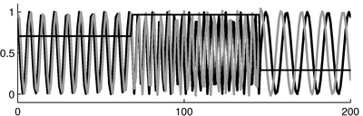
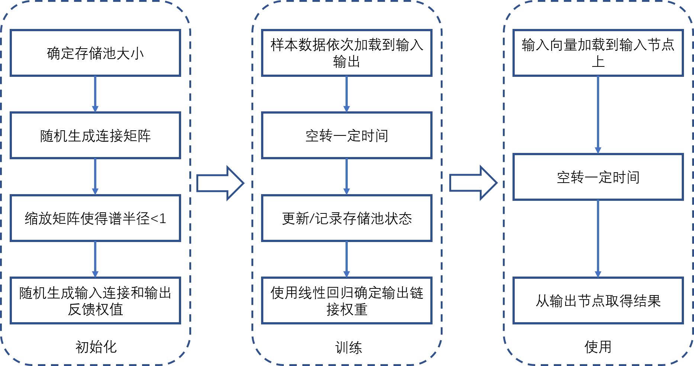

早前接触到了回声状态网络（Echo state networks, ESN)，苦于本月在为CSC做思想斗争，没有时间总结。现查阅ESN作者实验室的博文，记以备查[^defweb]。

> We would thanks Herbert Jaeger provide the main body for this article in English. please check the original article here: http://www.scholarpedia.org/article/Echo_state_network. Translate by waynehfut.

# 网络定义

回声状态网络最早见刊的论文可以追溯到2001年[^echop]，由德国的Herbert Jaeger研究组提出，与传统的有监督的递归神经网络（RNN）类似，回声状态网络由输入层（Input Layer）、隐藏层（Hidden Layer）和输出层（Output Layer）组成。其核心思想是：（1）使用输入信号去驱动结构固定的大型随机生成的递归神经网络，从而在该“存储”网络内的每个神经元中诱导非线性响应信号，（2）并通过所有这些响应信号的可训练线性组合来组合期望的输出信号。

ESN的基本概念与液体状态机（Liquid State Machines, LSM）类似，在传统的RNN的训练方法中，所有的权重都会被调整（不仅仅是输出权重），其中主要变化的输出权重。随着类人脑科学中遗忘概念的迁移，基于组合随机脉冲神经振荡器的RNN逐渐形成，也就是我们所知的ESN。

# 计算步骤

**在反向传播方法没有大规模应用于RNN之前**，假定需要处理线性生理信号或者遥感信号时，如果输入信号为缓慢变化的频率设置$u(n)$，期望的输出$y(n)$是基于当前输入所对应的频率的正弦波。以频率发生器为例，假设我们已经有了一批输入序列为$D = (u(1),y(1)),...,(u(n_{max}),y(n_{max}))$ （这里的输入时指缓慢变化的随机跃阶函数，对应的频率阶为1/16到1/4 Hz）。则训练任务便是根据这些训练数据训练RNN，使得模型在慢速变化的测试数据上输出与输入频率对应的正弦波。

在ESN中，对于上述问题，我们可以使用下述步骤解决，示例[代码(Matlab)](http://minds.jacobs-university.de/sites/default/files/uploads/papers/freqGen.zip)：

- **第一步**，定义一个随机的RNN：（1）使用任何神经元模型创建一个随机的具有动态存储层的RNN（在博文的示例中，我们使用了无跳层链接的Leaky积分神经元）。存储层$N$的大小取决于任务。在该例子中，我们使用的大小为200。（2）通过创建随机的全连接，将输入链接到存储层。（3）创建输出单元。如果任务需要输出反馈（频率发生器任务中需要），设置随机生成的输出层到存储层的链接。如果不需要输出反馈，在这个步骤中则不需要创建于输出单元的链接。
- **第二步**，获取存储状态：使用具有时序$n = 1, ... ,n_{max}$的训练数据$D$训练存储层中的存储状态。在原文示例中，由于存在着输出层到存储层的反馈链接，这意味着将输入$u(n)$写入输入单元的同时，还需要教导输出层拟合$y(n)$（目标机制）。在没有输出反馈的任务中，存储层仅有输入$u(n)$驱动。这也生成了一个$N$维存储层状态的序列$x(n)$。每个分量信号$x(n)$都是输入驱动的非线性变换。在示例中，每个$x(n)$都是慢速跃阶变化输入信号和快速输出正弦波的独立混合物（具体处理过程如下图所示）。

- **第三步**，计算输出权重：将输出权重计算为目标输出$y(n)$对存储层状态$x(n)$的线性回归权重。使用这些权重创建存储层到输出的链接，如上图的虚线箭头。至此，训练阶段完成，ESN就绪。下图展示了使用图1的结构所得到的结果。

# 理论细节

## 系统方程

基本的离散时间，乙状元(Sigmoid)回声状态网络由状态更新方程控制，该网络拥有$N$个存储单元、$K$个输入和$L$个输出。

$$x(n+1)=f(W*x(n)+ W^{in}*u(n+1)+\hat{W}*y(n)) \tag{1} $$

其中$x(n)$代表的是$N$维的存储层状态，$f$函数则是代表了乙状函数（一般使用逻辑乙状函数或者$tanh$函数）,$W$则是$N \times N$的存储单元，$W^{in}$代表了$N \times K$的输入权重矩阵，$u(n)$代表了$K$维的输入信号。$\hat{W}$ 代表了 $N \times L$输出反馈矩阵，$y(n)$代表了$L$维的输出信号。在不需要输出反馈的任务中，$\hat{W}$是无需定义的。在时刻$n$的拓展系统状态$z(n) = [x(n);u(n)]$关联了存储层和输入状态。而拓展系统的输出状态可以由下述公式计算：
$$y(n) = g(W^{out}z(n)) \tag{2} $$
其中$g$代表了输出的激活函数（通常是自定义或者是乙状元），$W^{out}$则代表了$L \times (K + N)$维的输出权重矩阵。

## 学习方程

在训练中的状态存储阶段，ESN由输入序列$u(1),...,u(n_{max})$，这些产生了拓展系统状态$z(1), ..., z(n_{max})$，系统公式中的(1), (2)便在此使用。如果你的模型包含输出反馈（例如，$\hat{W}$部分非零），那么在系统状态生成期间，正确的输出$d(n)$将被写入到输出单元（目标机制）。所得到的的拓展系统状态将被逐行归档到大小为$n_{max} \times (N +K)$的状态收集矩阵$S$中。通常，这样收集的状态的一些初始部分都会被丢弃，已适应时刻1所需的任意（随机或零）初始存储层状态的刷新。同样的，期望的输出$d(n)$被按行分类到大小为$n_{max} \times L$的目标输出集合矩阵$D$中。
期望输出的权重$W^{out}$是期望输出$d(n)$在获取拓展状态$z(n)$上的一系列的线性回归权重，数学上计算$W^{out}$最为直接的办法是调用$S$的伪逆（由$\dagger $表示）：

$$ W^{out}=(S^\dagger D)' \tag{3}$$

代表了一个离线的算法(素数表示矩阵转置)。从线性信号处理中已知的在线自适应方法也可以用来计算输出权重[^echop2]。

## 回声状态属性
为了使得ESN原理生效，存储层必须有回声状态特性(echo state property, ESP)，它将受激储层动力学的渐近性质与驱动信号相关联。直观的说，ESP认为存储层将渐进地从初始状态去除任何信息。当存储层权值矩阵（及泄漏率）满足奇异值代数条件时，对于可加的乙状神经元存储层，ESP是有保证的。对于$tanh$乙状元型存储层，当存储层权重矩阵的谱半径大于单位距离时，在零输入情况下ESP的无法保证的。相反的，根据经验观察，如果谱半径小于单位距离，则任何输入都可以被授予ESP。依据文献表述，这导致了对谱半径小于1的ESP的产生了广泛错误的识别。具体而言，输入幅度越大，在仍能获得ESP的情况下，谱半径的单位可能就越高。文献中显示，如果输入来自平稳源，ESP的概率为1或0。

## 记忆容量

由于RNN的自动反馈特性，存储层状态$x(n)$反映了过去输入历史的记录。这可以被视为一种动态的短期记忆。对于单输入的ESN,这种短期存储器的容量可以用$C=\sum_{i=1,2,...}r^2(u(n-i),y_i(n)),$其中$r^2(u(n-i),y_i(n))$是输入信号直接的平方相关系数是否延迟超过了$i$，以及训练后的输入信号$y_i(n)$，其被训练用于对输入信号$u(n)$进行回溯（记忆）$u(n-1)$的任务。结果表明，对于随机变量集合为独立同分布的（i.i.d）输入，大小为$N$的回声状态网络的记忆容量$C$以$N$为上界。在没有数值误差的情况下，这是线性存储层的上界。这些发现意味着不可能在需要无限时间内存的任务上训练ESN,例如上下文无关语法分析任务。然而，如果将反馈到存储器的输出单元训练为引导子存储单元，无上界存储跨度也可以通过ESN来实现。

# 应用问题：全局调优与规范化

当我们在非线性建模任务中使用ESN时，最终目标是最小化测试误差。机器学习中获得测试误差估计的一种标准方法是使用一部分可用的训练数据进行模型估计，并且监督模型在原始训练数据（验证数据）中的保留部分性能。问题是，如何优化ESN模型以减少验证及的错误？在机器学习的术语中，这个可以归结为一个问题，那就是如何为ESN模型设置适合任务的偏置（偏差）。对于ESN，有三种偏置（偏差）（广义上）需要调整。

第一种的偏差是采用正则化。这实质上是意味着模型是平滑的。实现某种平滑的两种标准方法如下：

- 岭回归（Ridge regression，也被称为Tikhonov正则化）：修改输出权重的线性回归方程(3)：
$$W^{out} = (R+\alpha^2I)^{-1}P \tag{4}$$
其中$R=1/n_{max}S'S$是拓展存储层的关联矩阵，$P=1/n_{max}$是状态与期望输出互相关的矩阵，$\alpha^2$代表了一些非负数（数值越大，平滑效果越明显），$I$则代表了身份矩阵。
- 状态噪声（State noise）:在状态获取时，使用噪声向量$v(n)$添加到存储层状态方式更新存储状态代替原来的公式(1):
$$x(n+1)=f(Wx(n)+W^{in}u(n+1)+\hat{W}y(n))+v(n) \tag{5}$$

上述方法都将导致更小的权重输出，附加的状态噪声也将使得计算更昂贵，但是在具有输出反馈的模型中，似乎还有使得最终解决方案更加稳定的好处。

第二种偏差是通过建立回声状态网络来实现的，正如人们所说的那样，它与我们想要建模的系统“动态相似”。例如，如果原始系统在一个缓慢的时间尺度上发展，那么ESN也应该具有同样的表现；或者原始系统的记忆单元跨度很长，ESN也应如此。实现这样主要动态特性是通过调整少量全局控制参数来实现的：

- 谱半径（Spectral radius）:存储层权重矩阵的谱半径共同确定了（1）回声状态网络的有效时间常数（较大的谱半径意味着脉冲响应的衰减速度更慢）和（2）输入分量随时间的非线性相互作用量（较大的谱半径意味着更长距离的相互作用）。
- 输入缩放（Input scaling）:输入比例共同决定了存储层的力学非线性程度。在某种极端情况下，有一个非常小的有效输入幅度时，存储层表现的状态与线性函数一致，而在另一个极端情况下，非常大的输入幅度驱动神经元达到乙状元的饱和状态，从而产生二元开关的状态。
- 输出反馈缩放（Output feedback scaling）:输出反馈缩放决定了训练ESN具有自主模式生成组件的程度。没有任何输出反馈的ESN是纯输入驱动的动态模式识别和分类任务的典型选择。另一方面，频率发生器演示任务需要强输出反馈来产生振荡（输入中不存在振荡）。非零输出反馈将带来动态不稳定的风险。
- 链接性（Connectivity）:存储层的权重矩阵的连通性通常被人为是存储层响应信号“丰富”的原因。分析可得以下推理路线：稀疏连通性$\to$将存储层的动力学分解成松散耦合的子系统$\to$存储层信号之间的大幅变化(理想状态下)。然而，与这种直觉相反，许多作者报告说，完全连通的存储层和稀疏连通的存储层工作性能一直。考虑到稀疏但随机连接的网络具有小世界特性，稀疏的随机接线不会导致动态解耦，因此最初的直觉是错误的。稀疏连通性的一个更实际的重要方面是，它产生了计算复杂性的线性缩放。如果存储器被设置成使得每个神经元平均连接到固定数量的其他神经元，而不管网络大小是多少，运行训练好的网络的计算成本仅随着网络大小的增加而线性增加。

最后，第三种偏差(这里的术语有点夸张)就是储层大小$N$。从统计学习理论的意义上来说，增加储层大小是增加模型容量的最直接方式。

# 局限性
自20世纪90年代初以来，人们已经知道了许多有监督的神经网络训练算法，最显著的是实时循环学习、随时间的反向传播、基于扩展卡尔曼滤波的方法和阿蒂亚-帕洛斯算法。所有这些算法都通过某种形式的梯度下降来适应所有连接(输入、循环、输出)。这使得这些算法很慢，甚至更麻烦的是，使得学习过程容易被分叉打断；无法保证收敛。因此，在ESNs被引入时，RNNs很少在实际工程应用中得到应用。相比之下，ESN培训速度快，不存在分叉，易于实施。在许多基准任务中，环境科学网络的表现明显优于所有其他非线性动力学建模方法。 今天(截至2019年)，随着深度学习的出现，基于梯度下降的递归神经网络训练所面临的问题可以被认为得到了解决。ESNs最初独特的卖点——稳定而简单的训练算法——已经消失。此外，RNNs的深度学习方法已被证明对高度复杂的建模任务是有效的，尤其是在语言和语音处理方面。达到类似的复杂程度将需要规模过大的水库。然而，当建模系统不太复杂，并且需要廉价、快速和自适应的训练时，储层计算方法是值得考虑的替代方法。这适用于信号处理的许多应用，例如生物信号处理、遥感或机器人电机控制。 从2010年左右开始，回声状态网络作为一种与非数字计算基底很好地融合的计算原理变得相关和非常流行，例如光学微芯片、机械纳米振荡器、基于忆阻器的神经形态微芯片、碳纳米管/聚合物混合物甚至人造软肢。这种非标准的计算材料和由它们制成的微器件通常缺乏数值精度，表现出显著的器件失配，并且模拟经典逻辑开关电路的方法是未知的。但是，通常非线性动力学可以从这些元素的适当互连集合中引出——也就是说，可以建立物理储层，为用ESN训练这些系统打开了大门。

# 构造过程
ESN的构造过程与现代的神经网络方法有所区别[^blog]，其构造方式如下图：

## 初始化
权重参数初始化，输入层初始化，存储层内部反馈权重初始化

在这部分初始化时，所有数据均随机初始化。其约束条件如下：
- $W_{in}$自区间$[-w_{in},w_{in}]$
- $\hat{W}$则由下述步骤产生：
    - 随机生成一个矩阵$\hat{W}_{random}$
    - 缩放$\hat{W}$使其满足ESP：$\hat{W}=\hat{W}_{random}\frac{\rho_{desired}}{\rho(\hat{W}_{random})}$

# 参考
[^echop]: Jaeger, H. (2001). The “echo state” approach to analysing and training recurrent neural networks-with an erratum note. Bonn, Germany: German National Research Center for Information Technology GMD Technical Report, 148(34), 13.

[^defweb]: http://www.scholarpedia.org/article/Echo_state_network

[^echop2]:  Adaptive nonlinear system identification with echo state networks. In Advances in Neural Information Processing Systems 15, S. Becker, S. Thrun, K. Obermayer (Eds), (MIT Press, Cambridge, MA, 2003) pp. 593-600

[^blog]: https://blog.csdn.net/cassiePython/article/details/80389394