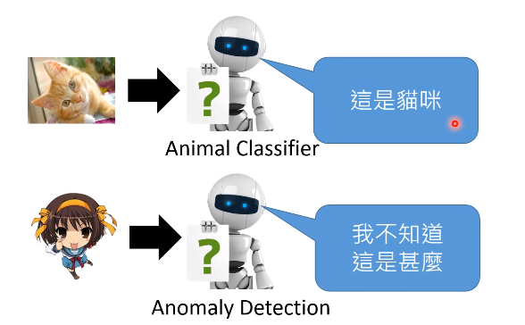
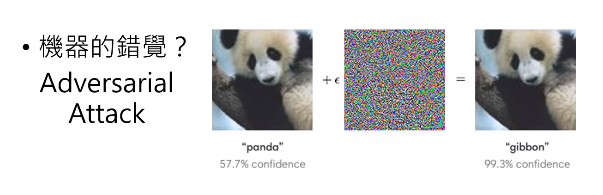
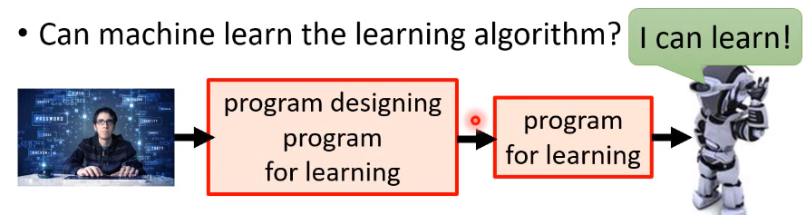
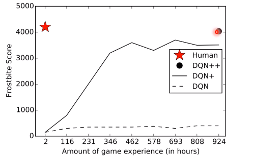
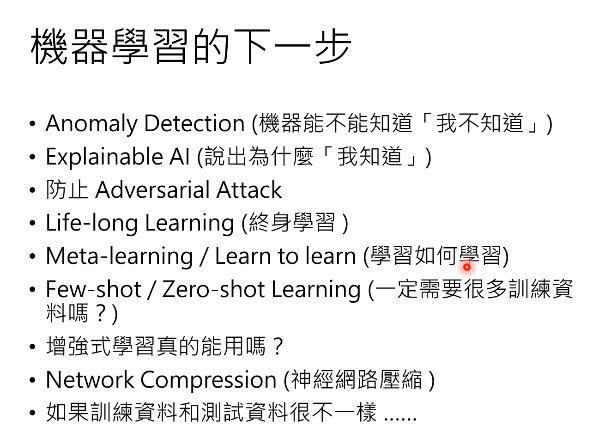

来源台大李宏毅课程，The next Step for Mechine Learning.
Youtube: https://www.youtube.com/watch?v=XnyM3-xtxHs

<!-- more -->
## 1. 机器能否知道自己“不知道”?
机器在识别图片时，可以识别到当前的这个物体，但是机器能否针对识别范围以外的物体识别出“不知道”。即当前的图片不认识时，能否给出“我拒绝回答”或者“我不知道”这样的结果。

## 2. 说出为什么“我知道”？
我们了解到了各式各样的神经网络，作出各种优秀的结果，但是神经网络为什么作出这样的决定？
a. “[神马汉斯](https://zh.wikipedia.org/zh-hans/%E5%8D%A1%E5%B0%94%C2%B7%E6%96%AF%E5%9B%BE%E5%A7%86%E5%A4%AB)”的例子就说明了，非人类的决策过程往往与人类决定的过程是相违背的，甚至是基于完全无关的依据来完成的。近年来，部分机器学习的方法，虽然有优异的处理结果，但是有时候往往学习到了无关的特征，这个特征往往并不是来源于我们所关心的真实样本，这与100多年前的神马汉斯的例子如出一辙。

b. 机器的错觉导致了模型无法可靠的运行。以下图为例，在早前的测试中，我们会认为这两个例子中的灰色圆形是一样的颜色，然而左侧的颜色实际更深，这也说明了即使是人类也会被错觉所误导。

因此对于深度学习而言，诸如对抗攻击（Adversarial Attack）等策略都会对模型的可靠性提出挑战，以至于在实际生产中利用Adversarial Attack 可以对自动驾驶等应用作出攻击，造成较大的损失。

这样的问题如何防止？

## 3. 机器有可能完成迭代更新Lifelong Learning（终身学习）？
现有的机器学习的方法都是对一个任务进行处理，动态的数据增长和应用环境都对模型提出挑战。同时不同的任务往往依赖于不同的技术，机器是否有能力在学习到某个任务后辅助它进行下一步的工作，以至于进行阶段学习。 
现有的方法体系中，学习了A以后，深度学习可以得到针对A的学习模型，接着对有着对A优秀处理能力的，但是换到B以后，B学好了，A可能性能又下降了。

## 4. 机器学习如何自学习？

写出一个可以写出有学习能力的程序的程序，即一个程序可以编辑出有自学习能力的程序。称之为Meta learning 或者Learn to learn

## 5. 一定要很多的数据进行学习吗？
1. Few-shot learning
依据少量的训练样本得到结果，或者得到有识别能力的模型
2. Zero-shot learning
依据其他数据实现对异类数据的识别，如利用文本数据识别出图片数据结果。

## 6. Reinforcement Learning?
强化学习可以在竞技游戏等领域得到与人所匹敌的水平，但是需要人类近10倍的时间耗费得到匹敌的效果。

最近的Alpha Zero等等都存在这样的问题。所以什么导致了这个问题？改进是否有可能？

## 7. 神经网络压缩技术
对受限的资源而言，如何将大的神经网络缩小，或者将神经网络参数二元化，降低计算负载。

## 8. 机器学习的谎言
训练资料和测试资料是相似的，但是实际应用中，数据分布往往是不一样的。

