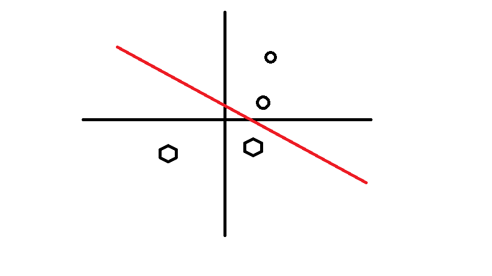
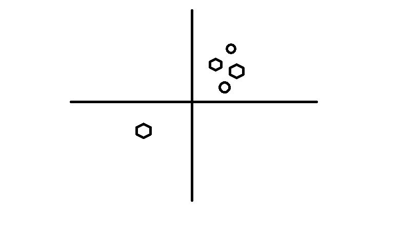
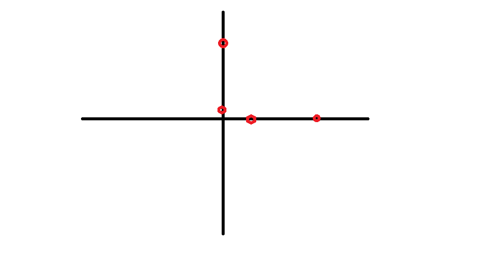

本次将说一下Keras中另一个例子[相关Link](https://github.com/keras-team/keras/blob/master/examples/cifar10_cnn.py)

正如题目所说的一样，这仍然是一个CNN的例子，但是有所不同的是，在这个例子中，我们将使用一个图像中一个常用的数据处理策略：Augmentation.

<!-- more -->
**cifar10:** 是加拿大政府组织推动建立的公开数据集，总计有10个类别。其共包含60K的标记的训练图，10K个测试图，相对于Mnist来说，数据集确实大了很多，但是我们需要注意的一点是，在cifar10这个数据集中，图片不再是单纯的手写数字而是实际生活中的物体图片，其中包含了许多的噪音和非相关的信息，因此较难以实现较高的识别率。参加Kaggle上的[介绍](https://www.kaggle.com/c/cifar-10)

**ImageDataGenerator：** 是Keras中一个比较流行的图片实时数据扩充方法，包括以下几个参数可供选择，而它存在于image模块中，它除了已经提供的数据扩充方法外，还提供了简单的数据扩充接口，方便数据的扩充。

|参数|功能|我的理解|
|:-|:-|:-|
|featurewise_center|布尔值，使输入数据集去中心化（均值为0）, 按feature执行|参见下一个参数
|featurewise_std_normalization|布尔值，将输入除以数据集的标准差以完成标准化, 按feature执行|实际上就是将数据除以自身的标准差，使得整体数据集能够更加“分散”|
|samplewise_center|布尔值，使输入数据的每个样本均值为0|实际上是按照数据自身进行标准化处理，避免数据过于集中，一般用于灰度图，参见下一个参数|
|samplewise_std_normalization|布尔值，将输入的每个样本除以其自身的标准差|一般来说，可以理解为将一个像素差别很大的图片进行标准化处理，更“平稳”|
|zca_whitening：|布尔值，对输入数据施加ZCA白化|官方解释：[ZCA](http://ufldl.stanford.edu/wiki/index.php/%E7%99%BD%E5%8C%96),我的理解为，找到图片中相关的信息，在[PCA](http://blog.codinglabs.org/articles/pca-tutorial.html)过程后，进行还原操作，减少无关数据，在降维的同时保证数据不会有太大缺失|
|zca_epsilon| ZCA使用的eposilon，默认1e-6|一般不做修改|
|rotation_range|整数，数据提升时图片随机转动的角度|非常常见的一个方法，旋转是图像中较为简单的一类数据扩充方法|
|width_shift_range|浮点数，图片宽度的某个比例，数据提升时图片水平偏移的幅度|参见下个参数|
|height_shift_range|浮点数，图片高度的某个比例，数据提升时图片竖直偏移的幅度|实际上width_shift_range & height_shift_range都是对图片的平移操作，但是要注意的是，平移的时候，它仅仅是移动一定的距离，新出现的部分会以`fill_mode`的要求补全，因此不能幅度过大|
|shear_range|浮点数，剪切强度（逆时针方向的剪切变换角度）|可理解为像素y轴的坐标不变，x轴的移动浮点数个单位的距离，达到的效果是斜拉|
|zoom_range|浮点数或形如`[lower,upper]`的列表，随机缩放的幅度，若为浮点数，则相当于`[lower,upper] = [1 - zoom_range, 1+zoom_range]`|即对图片进行拉伸|
|channel_shift_range|浮点数，随机通道偏移的幅度|即RGB的随意偏移，可理解为加上了有色眼镜|
|fill_mode|‘constant’，‘nearest’，‘reflect’或‘wrap’之一，当进行变换时超出边界的点将根据本参数给定的方法进行处理|可理解为Windows壁纸设置时，不够大时，所对应的“居中”，以及将最近像素复制的“最近”，和“镜像”和Windows中的“填充”|
|cval|浮点数或整数，当fill_mode=constant时，指定要向超出边界的点填充的值|与fill_mode相关，一般适用于“居中”时，数据不够是填充的内容，为单一像素|
|horizontal_flip|布尔值，进行随机水平翻转|参见下个参数|
|vertical_flip|布尔值，进行随机竖直翻转|horizontal_flip和vertical_flip是随机的进行水平和垂直翻转，较为常用|
|rescale|重放缩因子,默认为None. 如果为None或0则不进行放缩,否则会将该数值乘到数据上(在应用其他变换之前)|对图片的每个像素值均乘上这个放缩因子，这个操作在所有其它变换操作之前执行，在一些模型当中，直接输入原图的像素值可能会落入激活函数的“死亡区”，因此设置放缩因子为1/255，把像素值放缩到0和1之间有利于模型的收敛，避免神经元“死亡”。|
|preprocessing_function|将被应用于每个输入的函数。该函数将在任何其他修改之前运行。该函数接受一个参数，为一张图片（秩为3的numpy array），并且输出一个具有相同shape的numpy array|就理解为更前的预处理函数吧|
|data_format|字符串，“channel_first”或“channel_last”之一|参见[上篇](https://waynehfut.github.io/2018/02/28/mnist-cnn/)|

**Activation:** 激活函数，目的是将线性不可分的数据变为线性可分数据。具体可以理解为一个例子，下图中的圈和六角形就是可分的：

但是下图就是不可分的了

而图二的情况更容易在实际中出现，为此我们引入激活函数，使得原有坐标系变化为其他维度，从而线性可分，后续有空会细讲，请监督。
下图展示了一个计算到横轴纵轴最近值得激活函数激活后的表现情况：

此时再次可分。

其他代码不做细讲，有问题欢迎留言(前提正常访问谷歌的小伙伴才能看到留言。)

另，如您所见右下角的小红心和分享是您对我最大的支持！