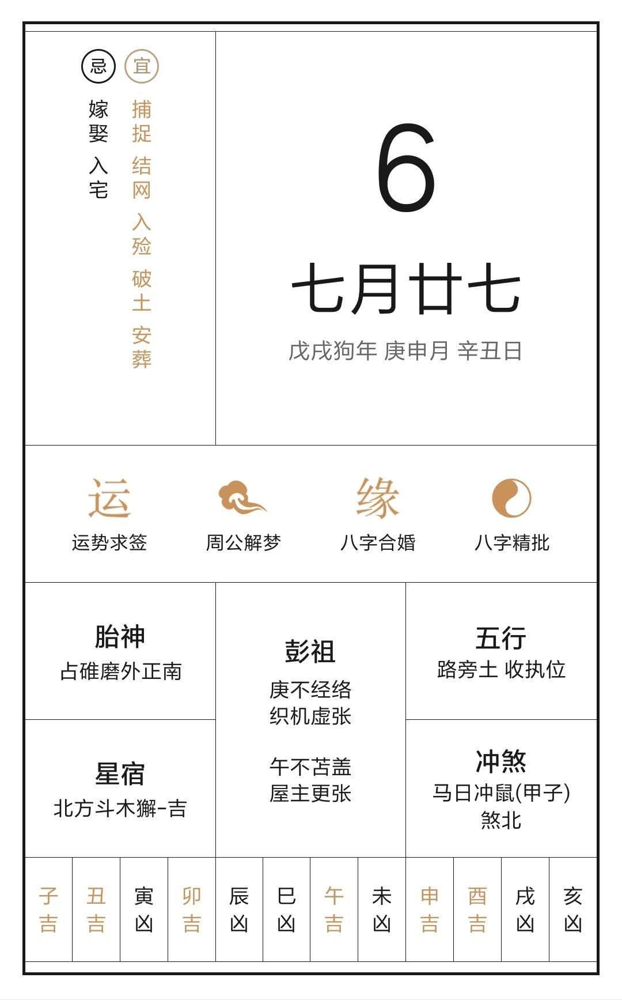

## 如果一个人无所畏惧，那他可能没有见证真正的死亡。
<!-- more -->

戊戌庚申辛丑辰时，祖父仙逝，享年柒什又玖。祖父一生与人为善，勤俭顾家，八十年的时光为整个家族奉献了自己，还未等晚辈尽孝，陆日因冠心病引起心肌梗死，猝然长逝。人生一淼淼，唯一粟尔。祖父这盏明灯，在生命的最后一刻仍为家族事务操心，最后一刻的嘱托都是家族团结，亲戚和睦，关心无微不至。从此人间少了一位善人智者，仙界多了一位贤者神明。悲乎哀哉！

一直明白，人固有一死，也意识到离家多年的我也会有一天因为长者的辞世而赶回。只是这一些来的太急太快，虽是赶上祖父的最后一刻，却让我深刻后悔前一夜没有多打一个电话，没有在多去爷爷奶奶家探望；也痛心爷爷为省钱而减少了关键药物的服用，儿女们都已经为您准备了充足的养老金，何苦如此。

六日的清晨，急促的电话，不断地消息，飞奔的动车，赶上了您的最后一面，慌乱的心率记录仪，您红肿的躯体，让人难过，为您赶回老家路上为您心肺复苏的那一阵子，汗水夹着泪水一滴滴的溅在您的衣服上，您虚弱的面庞喑哑的看向我，似乎楠楠的说着什么。可我再也听不见您的教诲。十点四十分，您在强撑着数个小时后，驾鹤西去，您还没看见我娶妻生子，您还没看见你的二孙金榜题名，您还没看见您的小孙为您端茶，您应当长命百岁啊！

冰棺封上的那刻，我幻想着灵异事件的发生，幻想着您突然惊醒，大骂我们不孝；拜灵堂的那刻，我幻想着有个仙人老道过来为我们施法救人，以慰您一生清明澄澈；直到火化当天我都在幻想，您的复生。可终究您还是在八日经历火化，躯壳化作晶石彻底的离开了我们，仅仅留下了一副肖像。爷爷，您一路走好！

爷爷的大智慧，为我们子子孙孙带来的不仅是家族的兴起，而是为人处世之道，世间倘若都如爷爷一般，天下大同。

未能尽孝是孙儿最大的遗憾，廿二年未能跪膝举案，孙儿大不敬不孝！而后数载孙当铭记教诲，尽吾之百万份力，兴起家族，以慰您在天之灵，愿您往生极乐！
