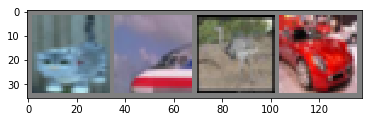
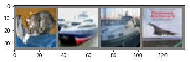

PyTorch的基础使用官方教程，主要描述了构建卷积神经网络

<!-- more -->

# 训练分类器

在已经知晓如何定义神经网络、计算损失和更新网络权重以后。
现在需要进一步思考

## 关于数据

通常而言，当你处理图像、文本、音频或者是视频数据是，你可以使用标准的python包，并加载到numpy中，之后你就可以将向量转换为`torch.*Tensor`

- 对于图像而言，使用诸如Pillow\OpenCV包都将非常有用
- 对于音频而言，可使用scipy和librosa
- 对于文本而言，使用原生的Python或者Cython接口，或者是NLTK和SpaCy都是有效的

对于视觉领域而言，Torch创建了名为`torchvision`的包，它拥有大多数数据集的数据加载方法，例如：ImageNet，CIFAR10，MNIST等，以及针对图片的数据转换器：`torchvision.datasets`和`torch.utils.data.DataLoader`

这样为使用过程提供了巨大的便利，并避免了重复编写样板代码的问题

在这篇入门教程中，主要是使用**CIFAR10**数据集，它有:`飞机`，`轿车`，`鸟`，`猫`，`鹿`，`狗`，`青蛙`，`马`，`船只`，`卡车`共计十个类别。**CIFAR-10**数据集的尺寸都是3x32x32，也就是说3-通道的彩图，并且每个图片尺寸为32x32


cifar10

## 训练一个图像分类器

我们将遵循下列步骤：
1. 使用`torchvision`加载并正则化CIFAR10训练和测试数据集
2. 定义一个卷积神经网络
3. 定义损失函数
4. 在训练数据集上训练网络
5. 在测试数据集上测试数据

### 加载并正则化CIFAR10数据

使用`torchvision`将使得处理CIFAR10数据变得极其简单


```python
import torch
import torchvision
import torchvision.transforms as transforms
```

torchvision数据集的输出是PILImage图片数据，取值范围处于[0,1]，我们将转换这些张量并正则化为[-1,1]


```python
# compose表示计算的串联，步骤1，转换为张量；步骤2，Normalize((mean),(std))是将数据按照通道以mean和std进行正则化，即：input[channel] = (input[channel] - mean[channel]) / std[channel]
transform = transforms.Compose( 
    [transforms.ToTensor(), 
    transforms.Normalize((0.5,0.5,0.5),(0.5,0.5,0.5))]) 、
trainset = torchvision.datasets.CIFAR10(root='./data', train=True,
                                                                        download=True, transform=transform)
# 第一个参数表述待处理数据，batch_size表示一个批数据处理的大小，shuffle表示每个epoch中数据是否打乱，num_workers表示有多少个字进程处理数据加载，默认为0
trainloader = torch.utils.data.DataLoader(trainset, batch_size=4,
                                                                        shuffle=True, num_workers=2)
testset = torchvision.datasets.CIFAR10(root='./data', train=False,
                                                                        download=True, transform=transform)
testloader = torch.utils.data.DataLoader(testset, batch_size=4,
                                                                        shuffle=False, num_workers=2)

classes = ('plane', 'car', 'bird', 'cat',
           'deer', 'dog', 'frog', 'horse', 'ship', 'truck')
```

    Files already downloaded and verified
    Files already downloaded and verified
    

让我们看下训练数据集


```python
import matplotlib.pyplot as plt
import numpy as np
#图片可视函数
def imshow(img):
    img = img / 2 + 0.5
    npimg = img.numpy()
    plt.imshow(np.transpose(npimg, (1, 2, 0)))
    plt.show()

# 随机取一些数据
dataiter = iter(trainloader)
images, labels = dataiter.next()
# 图片展示
imshow(torchvision.utils.make_grid(images))
#打印图片
```





### 定义一个卷积神经网络

可以从上篇复制网络结构过来，并将输入改为三个通道


```python
import torch.nn as nn
import torch.nn.functional as F


class Net(nn.Module):
    def __init__(self):
        super(Net, self).__init__()
        self.conv1 = nn.Conv2d(3, 6, 5)
        self.pool = nn.MaxPool2d(2, 2)
        self.conv2 = nn.Conv2d(6, 16, 5)
        # fc的第一个参数手动计算，参见 https://blog.csdn.net/zw__chen/article/details/82839061
        self.fc1 = nn.Linear(16 * 5 * 5, 120)
        self.fc2 = nn.Linear(120, 84)
        self.fc3 = nn.Linear(84, 10)

    def forward(self, x):
        x = self.pool(F.relu(self.conv1(x)))
        x = self.pool(F.relu(self.conv2(x)))
        x = x.view(-1, 16 * 5 * 5)
        x = F.relu(self.fc1(x))
        x = F.relu(self.fc2(x))
        x = self.fc3(x)
        return x


net = Net()
```

### 定义一个损失函数和优化器

我们使用分类交叉熵损失和具有momentum迭代策略的SGD优化器


```python
import torch.optim as optim
criterion = nn.CrossEntropyLoss()
optimizer = optim.SGD(net.parameters(), lr=0.001, momentum=0.9)
```

### 训练一个网络

从这里开始一切才变得有趣，我们简单的在数据迭代中进行循环，并将数据输入网络进行调整


```python
for epoch in range(2): #在数据集上重复循环多次
    running_loss = 0.0
    for i, data in enumerate(trainloader, 0):
        # 获取输入
        inputs, labels = data
        #将优化器的梯度置零
        optimizer.zero_grad()
        # 前馈+反向+优化
        outputs = net(inputs)
        loss = criterion(outputs, labels)
        loss.backward()
        optimizer.step()
        # 输出统计指标
        running_loss +=loss.item()
        if i % 2000==1999: #每两千次mini-batch输出一次
            print('[%d, %5d] loss: %.3f' % (epoch + 1, i + 1, running_loss /2000)) 
            running_loss = 0.0
print('Finish Training')
```

    [1,  2000] loss: 2.185
    [1,  4000] loss: 1.888
    [1,  6000] loss: 1.699
    [1,  8000] loss: 1.583
    [1, 10000] loss: 1.515
    [1, 12000] loss: 1.502
    [2,  2000] loss: 1.416
    [2,  4000] loss: 1.353
    [2,  6000] loss: 1.353
    [2,  8000] loss: 1.330
    [2, 10000] loss: 1.334
    [2, 12000] loss: 1.277
    Finish Training
    

### 在测试集上测试模型

我们已经在训练集上将模型训练了两遍，但是我们还需要检查模型是否真的学习到了什么

我们将通过在神经网络输出结果比较标签是否正确，并与事实对照，如果预测结果是正确的，我们将把正确的结果放到一个列表中。

首先，我们展示一些测试集数据熟悉一下图片


```python
dataiter = iter(testloader)
images, labels = dataiter.next()

# 打印图片
imshow(torchvision.utils.make_grid(images))
print('GroundTruth: ', ' '.join('%5s' % classes[labels[j]] for j in range(4)))
```





    GroundTruth:    cat  ship  ship plane
    

接下来让我们看下神经网络认为上述的图片是什么


```python
outputs = net(images)
print(outputs)
```

    tensor([[-2.7341, -2.1010,  0.8536,  2.9584, -0.1055,  1.9402,  1.6559, -1.0969,
             -1.1401, -1.6067],
            [ 2.8572,  4.1361, -1.3402, -1.8916, -1.7792, -3.6649, -3.3518, -3.7235,
              4.7233,  2.9778],
            [ 1.3926,  2.4972, -0.5155, -1.1045, -1.4472, -1.9245, -2.2989, -1.4306,
              2.1951,  1.9672],
            [ 1.8752, -0.1371,  0.9561, -0.2573,  0.3003, -1.3104, -2.2200, -0.9442,
              2.4067, -0.8872]], grad_fn=<AddmmBackward>)
    

输出的是10个类别的概率，越高的概率对应着神经网络所认为的类别，因此我们只需要最高可能性的即可


```python
_, predicted = torch.max(outputs, 1)
print('Predicted: ',' '.join('%5s' % classes[predicted[j]] for j in range(4)))
```

    Predicted:    cat  ship   car  ship
    

结果看上去非常的好

让我们再看下网络在整个数据集上的表现情况


```python
correct = 0
total = 0
with torch.no_grad():
    for data in testloader:
        images, labels = data
        outputs = net(images)
        _, predicted = torch.max(outputs.data, 1)
        total += labels.size(0)
        correct += (predicted == labels).sum().item()

print('Accuracy of the network on the 10000 test images: %d %%' % (100 * correct / total))
```

    Accuracy of the network on the 10000 test images: 55 %
    

看了总比碰运气好，将近10%的准确性可以认为神经网络确实学到了一些东西

也许有些类别学的很好，但是有些学的不好：


```python
class_correct = list(0. for i in range(10))
class_total = list(0. for i in range(10))
with torch.no_grad():
    for data in testloader:
        images, labels = data
        outputs = net(images)
        _, predicted = torch.max(outputs, 1)
        c = (predicted == labels).squeeze()
        for i in range(4):
            label = labels[i]
            class_correct[label] += c[i].item()
            class_total[label] += 1

for i in range(10):
    print('Accuracy of %5s : %2d %%' % (classes[i], 100*class_correct[i] / class_total[i]))
```

    Accuracy of plane : 60 %
    Accuracy of   car : 62 %
    Accuracy of  bird : 40 %
    Accuracy of   cat : 52 %
    Accuracy of  deer : 47 %
    Accuracy of   dog : 47 %
    Accuracy of  frog : 62 %
    Accuracy of horse : 60 %
    Accuracy of  ship : 59 %
    Accuracy of truck : 58 %
    

那么之后我们需要做什么？在GPU上如何加速？

## 在GPU上加速

正如将张量转移到GPU上一样，你也可以将神经网络转移到GPU上

如果CUDA可用，那么我首先将需要定义一个cuda可见的设备


```python
device = torch.device("cuda:0" if torch.cuda.is_available() else "cpu")
# 假定当前机器支持GPU,应当打印出CUDA设备
print(device)
```

    cpu
    

接下来的章节，假定`device`都是CUDA设备

然后这些方法将递归遍历所有模块并将其参数和缓冲区转换为CUDA张量：


```python
net.to(device)
```


    Net(
      (conv1): Conv2d(3, 6, kernel_size=(5, 5), stride=(1, 1))
      (pool): MaxPool2d(kernel_size=2, stride=2, padding=0, dilation=1, ceil_mode=False)
      (conv2): Conv2d(6, 16, kernel_size=(5, 5), stride=(1, 1))
      (fc1): Linear(in_features=400, out_features=120, bias=True)
      (fc2): Linear(in_features=120, out_features=84, bias=True)
      (fc3): Linear(in_features=84, out_features=10, bias=True)
    )


请记住，您还必须将每一步的输入和目标发送到GPU：


```python
inputs, labels = inputs.to(device), labels.to(device)
```

为什么我没有感到高速的加速呢？因为你的网络非常的小

练习：尝试增加网络的宽度（第一个nn.Conv2d的第二个参数和第二个nn.Conv2d的第一个参数  - 它们需要是相同的数字），看看你能获得什么样的加速。

## 在多个GPU上训练

如果您想使用所有GPU查看更多加速的内容，请查看[Data Parallelism](https://waynehfut.com/2019/04/12/torch4/)
