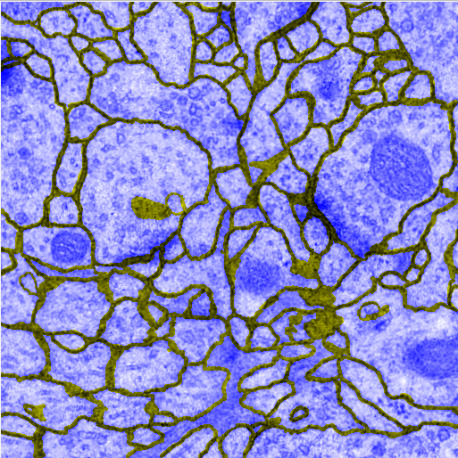
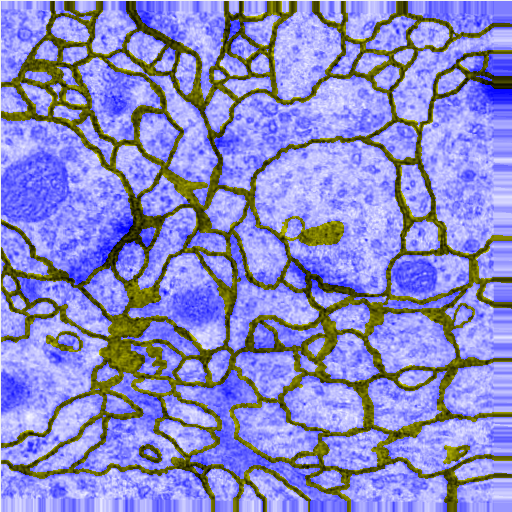
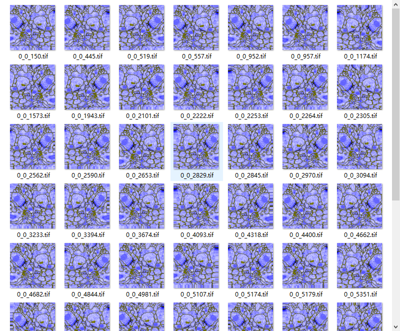

最近完成了一个自己的看到的论文的实验，从零开始从头到尾搭建了一个图像分割网络，来源依据是来源于2015年所提出的图像分割论文，参见[此处](https://arxiv.org/abs/1505.04597)，其采用的数据集是2015年ISBI主办的电子显微镜下的细胞分割挑战赛，其数据集相当小，总计只有30幅训练图和测试图，经过3天的折腾，参考了不少例子，基本上从零开始实现了这个神经网络，并在本地复现。下面是简单的介绍：
<!-- more -->

# 数据处理

首先我们需要从比赛官方下载数据集：[官方链接](http://brainiac2.mit.edu/isbi_challenge/)(需注册下载)，[我的分享](https://share.weiyun.com/c505e02e8e6bc83cb9862d71843684c8)(如果没有说明还在上传)。我们的数据展示如下：


我们看到的是：

|项目|说明|
|:-:|:-:|
|train-volume.tif|训练数据集|
|train-labels.tif|训练的标签|
|test-volume.tif|测试集|
每个数据文件都由30幅图片组成，共同组成了tif文件(Tag Image File Format，简写为tif,tiff, 一般包含多个图片压缩而成。)，当然我们需要将其分割开。

## 分割tif文件：

我在下述环境下：

- Platform: Windows
- Python version: Anaconda2 5.1.0
- Python package: libtiff

编写了转换代码：

```python
#!/usr/bin/env python
# encoding: utf-8
# Attention! this code can't running on Windows(R) under python 3.X
# Pls using conda create a new virtual environment with python version 2.7.

"""
@author: Waynehfut
@contact: Waynehfut@gmail.com
@site: http://waynehfut.github.io
@software: PyCharm
@file: trans_vol.py
@time: 2018/2/26 17:30
"""
from libtiff import TIFF3D, TIFF
import os


class TIFFtrans:
    def split_tifs(self, tif_file):
    # 将tif文件分割为单个tif图像
        print(tif_file)
        tif = TIFF3D.open(tif_file + '.tif')
        tif_imgs = tif.read_image()
        for items in range(tif_imgs.shape[0]):#shape[0]是tif压缩文件的总数量
            img_name = tif_file + "\\" + str(items) + ".tif"
            image = TIFF.open(img_name, 'w')
            image.write_image(tif_imgs[items])

    def merge_tifs(self, sou_path, des_file):
        image_dir = TIFF3D.open(des_file, 'w')
        image_array = []
        for i in range(len(os.listdir('./'))):
            image = TIFF.open(image_dir + str(i) + ".tif")
            image_array.append(image.read_image())
        image_dir.write_image(image_array)


# trans code
tiff_tools = TIFFtrans()
file_list = ('test-volume', 'train-labels', 'train-volume') #依次遍历所有压缩的tif文件
    tiff_tools.split_tifs(item)

```

通过上述切割，将可以完成从压缩的tif文件到单个tif文件的转换
如下图所示：


## 图片转换扩充

经过分割数据之后，发现之前的数据量相对较少，为了实现图像的分割，需要对数据进行增强，增强的方法是将原始图片作为一个通道（通道0），将边缘作为另一个通道（通道1）。因为原始数据是灰度图的原因，故而三个通道的图片可以承载全部数据。将这些数据合并到一个三通道的图像上后，我们利用[前文](https://waynehfut.github.io/2018/03/04/cifar10-cnn/)提到的`ImageDataGenerator`方法实现数据扩充。
具体做法参见如下部分：

### 合并原始图像和标签图像的过程

```python
for i in range(len(trains)):
    img_t = load_img(path_train + "/" + str(i) + "." + imgtype)  # 读入train
    img_l = load_img(path_label + "/" + str(i) + "." + imgtype)  # 读入label
    x_t = img_to_array(img_t)                                    # 转换成矩阵
    x_l = img_to_array(img_l)
    x_t[:, :, 2] = x_l[:, :, 0]                                  # 把label当做train的第三个通道
    img_tmp = array_to_img(x_t)
    img_tmp.save(path_merge + "/" + str(i) + "." + imgtype)      # 保存合并后的图像
    img = x_t
    img = img.reshape((1,) + img.shape)                          # 改变shape(1, 512, 512, 3)
    savedir = path_aug_merge + "/" + str(i)                      # 存储合并增强后的图像
    if not os.path.lexists(savedir):
        os.mkdir(savedir)
```

合并后的图像示例如下(因为0通道和2通道合并的关系，灰度图会变为紫色)：


### 执行扩充操作

```python
def doAugmentate(self, img, save_to_dir, save_prefix, batch_size=1, save_format='tif', imgnum=30):
    datagen = self.datagen
    i = 0
    for batch in datagen.flow(img,
                              batch_size=batch_size,
                              save_to_dir=save_to_dir,
                              save_prefix=save_prefix,
                              save_format=save_format):
        i += 1
        if i > imgnum:
            break
```

在这个部分，我们总计扩展了30次，需要注意的是，这里的 `self.datagen` 已经预定义为:

 ```python
 self.datagen = ImageDataGenerator(
            rotation_range=0.2,
            width_shift_range=0.05,
            height_shift_range=0.05,
            shear_range=0.05,
            zoom_range=0.05,
            horizontal_flip=True,
            fill_mode='nearest')
 ```

 一个扩充示例如下(做了相位平移和边缘裁切)：

 

### 分割扩充后的数据

 ```python
for i in range(self.slices):
    path = path_merge + "/" + str(i)
    print(path)
    train_imgs = glob.glob(path + "/*." + self.img_type)  # 所有训练图像
    savedir = path_train + "/" + str(i)                   # 保存训练集的路径
    if not os.path.lexists(savedir):
        os.mkdir(savedir)
    savedir = path_label + "/" + str(i)                   # 保存label的路径
    if not os.path.lexists(savedir):
        os.mkdir(savedir)
    for imgname in train_imgs:         # rindex("/") 是返回'/'在字符串中最后一次出现的索引
        midname = imgname[imgname.rindex("/") + 1:imgname.rindex("." + self.img_type)] # 获得文件名(不包含后缀)
        img = cv2.imread(imgname)      # 读入训练图像
        img_train = img[:, :, 2]  # 训练集是第2个通道, label是第0个通道
        img_label = img[:, :, 0]
        cv2.imwrite(path_train + "/" + str(i) + "/" + midname + "_train" + "." + self.img_type, img_train) # 保存训练图像和label
        cv2.imwrite(path_label + "/" + str(i) + "/" + midname + "_label" + "." + self.img_type, img_label)
 ```

 至此，我们完成了数据扩充任务。并且从原来的30个图变为了30*30=900张图片。
 如下图所示：


下一篇将会说，这些数据如何在实践中的使用。以及如何进行分割，完整项目将在这个系列更新完后上传到[github](https://github.com/waynehfut)，欢迎查看。