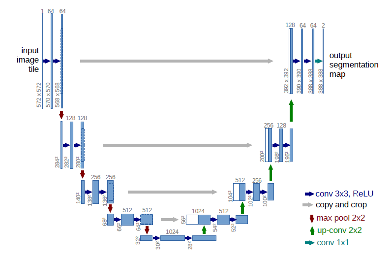
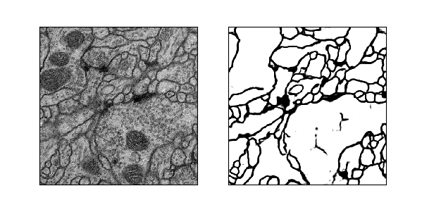

接上篇，最近完成了一个自己的看到的论文的实验，从零开始从头到尾搭建了一个图像分割网络，来源依据是来源于2015年所提出的图像分割论文，参见[此处](https://arxiv.org/abs/1505.04597)，接着[上篇](https://waynehfut.github.io/2018/03/06/%E4%BB%8E%E9%9B%B6%E5%BC%80%E5%A7%8B%E6%9E%84%E5%BB%BA%E5%9B%BE%E5%83%8F%E5%88%86%E5%89%B2%E6%A8%A1%E5%9E%8B%EF%BC%88%E4%B8%80%EF%BC%89/)的内容，这篇主要是完成数据导入到神经网络和神经网络构建的内容。
<!-- more -->

# 数据转换

在keras官方的教程里面，我们可以看到原始的图片是可以作为输入数据之间带到神经网络的，但大多数情况下，我们会将这图片数据转换为数组进行存储，便于进一步操作，一般会转换为numpy矩阵进行保存，下列代码将完成从训练图片到numpy数据的转换。

## 训练数据的转换

我们以训练数据为例，数据首先是通过计算拓展后的数据总量导入数据，导入后的数据，会首先利用keras的image modle导入图片，之后转换为npy文件并保存。

```python
def create_train_data(self):
    # 将增强之后的训练集生成npy
    i = 0 # 进行图片计数
    print('-' * 30)
    print('creating train image')
    print('-' * 30)
    count = 0
    # 读入的是合并后的拓展数据，其实是为了计数。
    for indir in os.listdir(self.aug_merge_path):
        path = os.path.join(self.aug_merge_path, indir)
        count += len(os.listdir(path))
    # 初始化一个空的训练数据和标签数据-对应到原始图片和分割区域
    imgdatas = np.ndarray((count, self.out_rows, self.out_cols, 1), dtype=np.uint8)
    imglabels = np.ndarray((count, self.out_rows, self.out_cols, 1), dtype=np.uint8)
    for indir in os.listdir(self.aug_merge_path):
        # 读取到所有拓展后的训练图片和标签数据
        trainPath = os.path.join(self.aug_train_path, indir)
        labelPath = os.path.join(self.aug_label_path, indir)
        imgs = glob.glob(trainPath + '/*' + '.tif')
        for imgname in imgs:
            trainmidname = imgname[imgname.rindex('/') + 1:]
            labelimgname = imgname[imgname.rindex('/') + 1:imgname.rindex('_')] + '_label.tif'
            # 以灰度的方式读入图片数据
            img = load_img(trainPath + '/' + trainmidname, grayscale=True)
            label = load_img(labelPath + '/' + labelimgname, grayscale=True)
            # 转为numpy数据
            img = img_to_array(img)
            label = img_to_array(label)
            imgdatas[i] = img
            imglabels[i] = label
            # 显示进度
            if i % 100 == 0:
                print('Done: {0}/{1} images'.format(i, len(imgs)))
            i += 1
            print(i)
    # 保存为npy文件
    np.save(self.npy_path + '/imgs_train.npy', imgdatas)
    np.save(self.npy_path + '/imgs_mask_train.npy', imglabels)
    print('Saving to .npy files done.')
```

同理可以处理test数据。
之后的数据大致预览如下：


## 进一步处理

在得到这些npy文件后，我们会需要对数据进一步处理以使其适用于神经网络,包括归一化和去均值，以减小计算量，加速收敛。

```python
def load_train_data(self):
    # 读入训练数据包括label_mask(npy格式), 归一化(只减去了均值)
    print('-' * 30)
    print('load train images...')
    print('-' * 30)
    imgs_train = np.load(self.npy_path + "/imgs_train.npy")
    imgs_mask_train = np.load(self.npy_path + "/imgs_mask_train.npy")
    imgs_train = imgs_train.astype('float32')
    imgs_mask_train = imgs_mask_train.astype('float32')
    imgs_train /= 255
    mean = imgs_train.mean(axis=0)
    imgs_train -= mean
    imgs_mask_train /= 255
    imgs_mask_train[imgs_mask_train > 0.5] = 1
    imgs_mask_train[imgs_mask_train <= 0.5] = 0
    return imgs_train, imgs_mask_train
```

# 神经网络构建

在有了这部分数据后，我们将会构建起神经网络，下面的代码展示了利用keras构建得到的网络模型的基本结构：

```python
def get_unet(self):
    inputs = Input((self.img_rows, self.img_cols, 1))
    conv1 = Conv2D(64, 3, activation='relu', padding='same', kernel_initializer='he_normal')(inputs)
    conv1 = Conv2D(64, 3, activation='relu', padding='same', kernel_initializer='he_normal')(conv1)
    pool1 = MaxPooling2D(pool_size=(2, 2))(conv1)
    conv2 = Conv2D(128, 3, activation='relu', padding='same', kernel_initializer='he_normal')(pool1)
    conv2 = Conv2D(128, 3, activation='relu', padding='same', kernel_initializer='he_normal')(conv2)
    pool2 = MaxPooling2D(pool_size=(2, 2))(conv2)
    conv3 = Conv2D(256, 3, activation='relu', padding='same', kernel_initializer='he_normal')(pool2)
    conv3 = Conv2D(256, 3, activation='relu', padding='same', kernel_initializer='he_normal')(conv3)
    pool3 = MaxPooling2D(pool_size=(2, 2))(conv3)
    conv4 = Conv2D(512, 3, activation='relu', padding='same', kernel_initializer='he_normal')(pool3)
    conv4 = Conv2D(512, 3, activation='relu', padding='same', kernel_initializer='he_normal')(conv4)
    drop4 = Dropout(0.5)(conv4)
    pool4 = MaxPooling2D(pool_size=(2, 2))(drop4)
    conv5 = Conv2D(1024, 3, activation='relu', padding='same', kernel_initializer='he_normal')(pool4)
    conv5 = Conv2D(1024, 3, activation='relu', padding='same', kernel_initializer='he_normal')(conv5)
    drop5 = Dropout(0.5)(conv5)
    up6 = Conv2D(512, 2, activation='relu', padding='same', kernel_initializer='he_normal')(UpSampling2D(size=(2, 2))(drop5))
    merge6 = merge([drop4, up6], mode='concat', concat_axis=3)
    conv6 = Conv2D(512, 3, activation='relu', padding='same', kernel_initializer='he_normal')(merge6)
    conv6 = Conv2D(512, 3, activation='relu', padding='same', kernel_initializer='he_normal')(conv6)
    up7 = Conv2D(256, 2, activation='relu', padding='same', kernel_initializer='he_normal')(UpSampling2D(size=(2, 2))(conv6))
    merge7 = merge([conv3, up7], mode='concat', concat_axis=3)
    conv7 = Conv2D(256, 3, activation='relu', padding='same', kernel_initializer='he_normal')(merge7)
    conv7 = Conv2D(256, 3, activation='relu', padding='same', kernel_initializer='he_normal')(conv7)
    up8 = Conv2D(128, 2, activation='relu', padding='same', kernel_initializer='he_normal')(UpSampling2D(size=(2, 2))(conv7))
    merge8 = merge([conv2, up8], mode='concat', concat_axis=3)
    conv8 = Conv2D(128, 3, activation='relu', padding='same', kernel_initializer='he_normal')(merge8)
    conv8 = Conv2D(128, 3, activation='relu', padding='same', kernel_initializer='he_normal')(conv8)
    up9 = Conv2D(64, 2, activation='relu', padding='same', kernel_initializer='he_normal')(UpSampling2D(size=(2, 2))(conv8))
    merge9 = merge([conv1, up9], mode='concat', concat_axis=3)
    conv9 = Conv2D(64, 3, activation='relu', padding='same', kernel_initializer='he_normal')(merge9)
    conv9 = Conv2D(64, 3, activation='relu', padding='same', kernel_initializer='he_normal')(conv9)
    conv9 = Conv2D(2, 3, activation='relu', padding='same', kernel_initializer='he_normal')(conv9)
    conv10 = Conv2D(1, 1, activation='sigmoid')(conv9)
    model = Model(input=inputs, output=conv10)
    model.compile(optimizer=Adam(lr=1e-4), loss='binary_crossentropy', metrics=['accuracy'])
    return model
```

上述代码构建得到的神经网络大致的结构如下（图片来源于论文原文）：

在这里需要解释的是：

## merge层

这部分的代码在最新的keras中已经被`keras.layers.merge`替换，在这里是将两个同等大小的keras向量合并为一个向量也就是我们在上图中看到的crop and copy.但是这并不影响我们的使用，在这里concat_axis被设置为3，即是将其拼接起来，如果是设置为1或者2即会合并为一个与输入数据大小一致的矩阵，无法在后续上采样中还原会原始数据。

## 网络结构简析

网络结构在前半部分(inputs->drop5)与传统的CNN并无差异，但是在这个之后，采用了一个upsample的操作，这个方法的意义在于做了反卷积操作，关于反卷积可以参考[此处](https://github.com/vdumoulin/conv_arithmetic)，获得更多深入解释。在这里，我们可以理解反卷积是做了一个与卷积相反的操作：即把原先的矩阵上采样化，可以得到卷积核所卷出的特征数据，降低噪音的权重，在上采样后，通过merge层的合并，可以将前部数据进行合并，避免卷积和上采样造成的数据丢失，如：`merge([conv1, up9], mode='concat', concat_axis=3)`即合并了第一层卷积核最后一层采样的数据。通俗来说，就是神经网络已经掌握了图像的核心特征，现在他要出师了，为了能让他不忘初心，把以前的辛酸泪再给他看看，避免后面太跳，导致过拟合。最后，网络的损失函数还是`binary_crossentropy`完成。

# 训练与测试

有了网络以后，我们需要对网络进行训练和测试，下述简要介绍了如何进行训练和测试

## 网络的训练

```python
def train(self):
    # 这部分将之前所保存的训练图片、图片标记、测试图片所转换的npy文件加载到程序中
    imgs_train, imgs_mask_train, imgs_test = self.load_data()
    # 读取上节所构建的神经网络结构
    model = self.get_unet()
    # 保存的是权重
    model_checkpoint = ModelCheckpoint('unet.hdf5', monitor='loss', verbose=1, save_best_only=True)
    # 开始训练
    model.fit(imgs_train, imgs_mask_train, batch_size=1, epochs=10, verbose=1, shuffle=True,callbacks=[model_checkpoint])
```

这部分与以前介绍的神经网络无异，有不理解的，可以翻阅前文。特别的是，keras对于model的保存提供了接口`ModelCheckpoint`,可以依据每个epoch的效果保存最优结果，并存在hdf5文件中。

## 网络的验证

```python
def test(self):
    # 导入数据
    imgs_train, imgs_mask_train, imgs_test = self.load_data()
    # 加载网络结构
    model = self.get_unet()
    # 加载权重
    model.load_weights('./unet.hdf5')
    # 进行预测
    imgs_mask_test = model.predict(imgs_test, batch_size=1, verbose=1)
    # 保存预测的结果，可用于可视化
    np.save('imgs_mask_test1.npy', imgs_mask_test)
```

检测结果如下所示：



至此，如何将前述的图片转换为神经网络可读的数据，如何构建神经网络，以及训练和测试以及简单介绍完毕，下节将简单介绍一个基于此网络可视化的小工具，以展示神经网络到底如何用在实际的图片检测中。

> PS: 可以访问谷歌的朋友们，你们将可以通过disqus进行评论，网络不便捷的朋友，可以点击左侧关于我，进行沟通联系。谢谢！